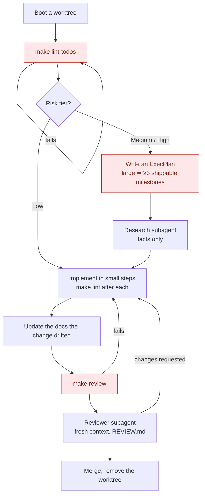

# EnHarnes

A repository template for engineering with AI coding agents, on one principle: **humans steer, agents execute.**

The agent is given a control panel it must read, a task loop it must follow, and gates it cannot talk its way past. The mistakes an agent makes quietly — writing to the integration branch, skipping a plan, shipping an oversized change, reporting a check it did not run — are each caught by something deterministic rather than by good intentions.

What you fill in is small and named: your project's context and autonomy tiers in `AGENTS.md`, your layers in `ARCHITECTURE.md`, your thresholds in `policies/`. Everything else arrives working — the guards, the gates, the plan format, the review policy, and the checks that test the guards themselves.

## Quick start

```bash
# 1. Create your repository from this template, then:
python3 -m venv .venv && . .venv/bin/activate
pip install -r requirements.txt
make install-hooks        # pre-commit + Claude Code hooks

# 2. Tell the harness what your project is
#    - AGENTS.md          → project context, autonomy tiers, reference table
#    - ARCHITECTURE.md    → your layers
#    - policies/          → risk tiers, size budgets, lint rules

# 3. Track this template so you can take fixes later
cp .claude/skills/harness.upstream/state.example.json \
   .claude/skills/harness.upstream/state.json
#    fill in the upstream URL and the commit you forked from

make lint                 # everything CI enforces
```

`ONBOARDING.md` walks a new project from requirements to first code.

## The loop

Every task runs this shape. The three red gates are hard stops: the agent does not proceed past one by deciding it is fine.



High risk stops at the plan: it is written, and a human decides whether it is built.

Two things run underneath and are not steps in the loop: the **hooks**, on every command and every edit, and the **pre-commit hook**, which runs `make lint` whether or not anyone remembered to.

## What it looks like

**A guard refuses, and says what to do instead.** Every denial carries the same closing paragraph, appended at one place in the code so no rule can ship without it:

```
Force push to main/master is blocked — rewriting published history is an
owner-run exception (AGENTS.md). Push a task branch and open a merge request;
if you rebased your own branch, `--force-with-lease` on THAT branch is fine.

This block is a decision, not an obstacle. Do NOT re-spell the command, split
it, encode it, or move it into a file and run that — the guard reads the text
of a Bash call, so a script file is unaudited, and routing around a block is
forbidden (AGENTS.md, DO NOT USE). Three honest responses: the command should
not run; or the guard is wrong — then fix the guard, add the case to
scripts/verify/verify_force_push_guard.py, and have the fix reviewed; or both
are right and the step you need has no sanctioned tool yet — then build one,
in committed code, and use that.
```

A refusal with no third option is a dead end, and a dead end is when working around the guard starts to look reasonable.

**A plan declares its own size, and the declaration is enforced.** A plan that calls itself large must show it has been cut into independently shippable pieces, before any code is written:

```markdown
## Change-size

Change-size class: large

- M1 — bootstrap the schema. → PR
- M2 — migrate readers. → PR
- M3 — migrate writers, remove the old path. → PR
```

Fewer than three and `make lint` fails, unless the section also carries `SIZE-OVERRIDE: <reason>`, which turns the block into a warning that repeats the reason. The ship token is configurable in `policies/size-policy.json`.

## What's inside

| Path | What lives there |
|---|---|
| `AGENTS.md` | The control panel: task loop, autonomy tiers, failure ledger, hard rules |
| `CLAUDE.md` | Session rules specific to the Claude Code CLI |
| `ARCHITECTURE.md` · `policies/` | Layer map, risk tiers, size budgets, machine-readable lint rules |
| `REVIEW.md` | The single review policy — passes, severity bar, what not to report |
| `.claude/hooks/` | Eight hooks that run automatically: two guards, two reporters, three session and lifecycle hooks, one shared wire contract |
| `.claude/skills/` | Eleven skills — planning, linters, generators, review panel, upstream sync, debugging protocol |
| `.claude/agents/harness/` | Nine subagent roles: researcher, reviewer, verifier, and six analysers |
| `scripts/harness/` | Worktree bootstrap, upstream sync, the pre-commit hook |
| `scripts/verify/` | Behavioural checks on the harness itself — the guards are tested, not trusted |
| `docs/` | Living source of truth: design docs, execution plans, references, generated indexes |
| `.github/workflows/` | CI lint, nightly entropy scan, worktree verification, weekly TODO cleanup |

## Commands

```bash
make lint          # everything CI blocks on (see below)
make review        # pre-PR gate: lint + doc drift + watch paths + entropy + change size
make ci            # alias for lint
```

`make lint` runs seven checks: TODO ownership and plan placement (`lint-todos`), code conventions and hook registration (`lint-src`), architecture boundaries (`lint-structural`), lint-rule YAML (`lint-yaml`), `ast-grep` scan (`lint-ast`), the hook contract and force-push table (`lint-hooks`), and the upstream classifier (`lint-upstream`).

Cadenced, not per-commit:

```bash
make check-docs        # stale headers, broken links
make check-entropy     # orphan scripts, blank setpoints
make upstream-check    # what the template changed, and what you changed in its files
make verify-worktree   # worktree bootstrap, end to end
```

Generators: `make gen-handbook`, `make sync-todos`, `make sync-skills`, `make sync-indexes`.

## How the guarantees hold

Three layers, deliberately overlapping, because each one has a blind spot the next covers:

1. **Hooks** run inside the agent's session. They refuse a force push to the integration branch, refuse file edits on it, ask before a command discards uncommitted work, and report shell writes that reached the integration branch by a route no pre-flight guard can inspect.
2. **Gates** run on the developer's machine and in CI — the same code, so `make lint` locally means what CI means. A plan that declares itself large must decompose; a branch over its size budget blocks until it is split or explicitly overridden.
3. **`scripts/verify/`** tests the guards themselves, against fabricated repositories, with no network. This exists because a guard that has silently stopped enforcing looks exactly like a guard that works — it has happened here, and the deny table stayed green throughout.

## Staying current with the template

A fork drifts in both directions: the template ships fixes you never see, and you fix template-owned code the template still has broken.

```bash
make upstream-check    # status, what to take, what to offer back
```

`python scripts/harness/upstream_sync.py diff <path>` shows a single divergence. Nothing moves automatically — the tool classifies, you decide, and each pass leaves a dated note. The procedure is in `.claude/skills/harness.upstream/SKILL.md`.

## Requirements

Python 3, `make`, `git`. Dependencies are in `requirements.txt`: `pytest`, `PyYAML`, `ast-grep-cli`, `printdirtree`. `ast-grep` checks skip themselves when the tool is absent, so a partial install still lints.
